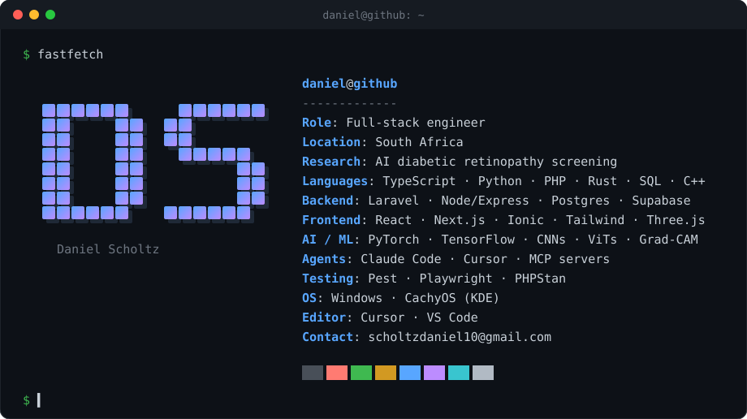

  

### Selected work

| Project | What it is | Stack |
|---|---|---|
| **[agent-orchestrator](https://github.com/scholtzdaniel10/agent-orchestrator)** | Desktop app that routes coding jobs across your own Claude Code and Cursor subscriptions. In progress. | Electron · TypeScript |
| **[IrixDB](https://github.com/scholtzdaniel10/IrixDB)** | Local-first document database in a single binary. Write-ahead log, snapshot/restore, JWT auth with RBAC, WebSocket change subscriptions. | Rust · Axum · WAL |
| **[ddos-attack-map](https://github.com/scholtzdaniel10/ddos-attack-map)** | Real-time 3D globe plotting live attack traffic from Cloudflare and AbuseIPDB, with an ML classifier scoring threat level per source. | React Three Fiber · Express · WebSockets · scikit-learn |
| **[Jarvis](https://github.com/scholtzdaniel10/Jarvis)** | Natural-language command interpreter and dispatcher. Every intent carries a safety class; destructive actions are gated behind explicit confirmation. | Python (stdlib only) |

### Research

Postgraduate work on **AI-based diabetic retinopathy screening** for under-resourced clinics: CNNs and Vision Transformers with transfer learning, plus explainability (Grad-CAM, SHAP) so clinicians can see why a model flagged an image.

### Contact

[Email](mailto:scholtzdaniel10@gmail.com) · [LinkedIn](https://www.linkedin.com/in/daniel-scholtz-b2482135b/)
